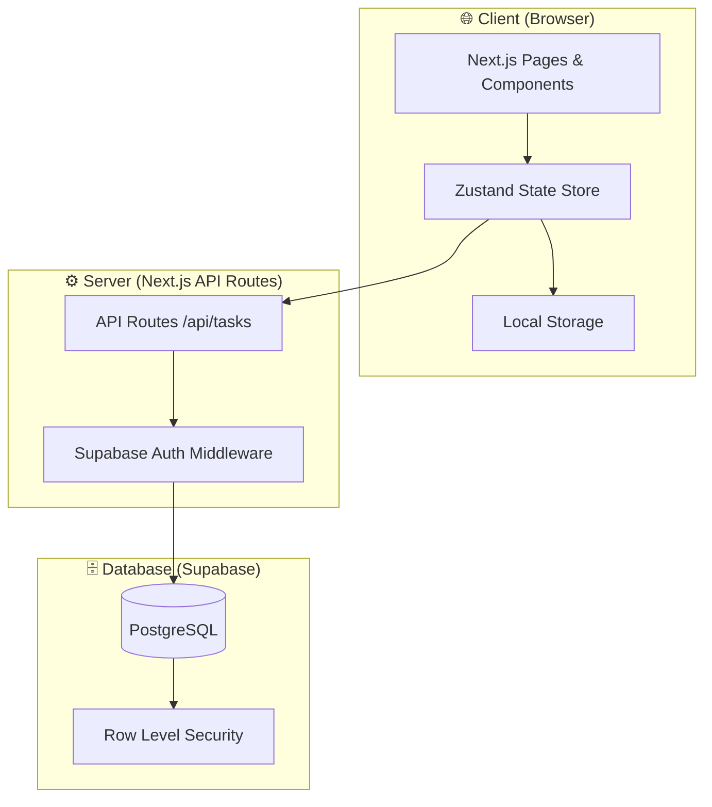
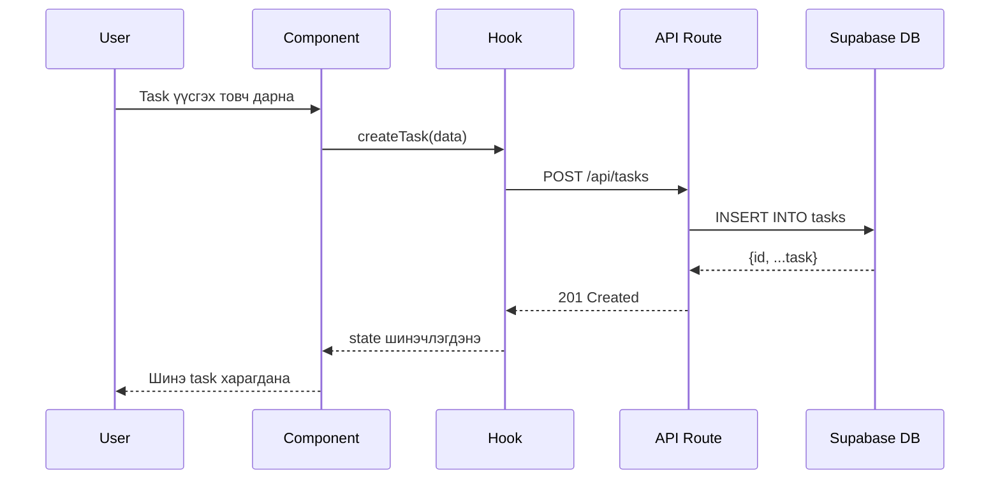
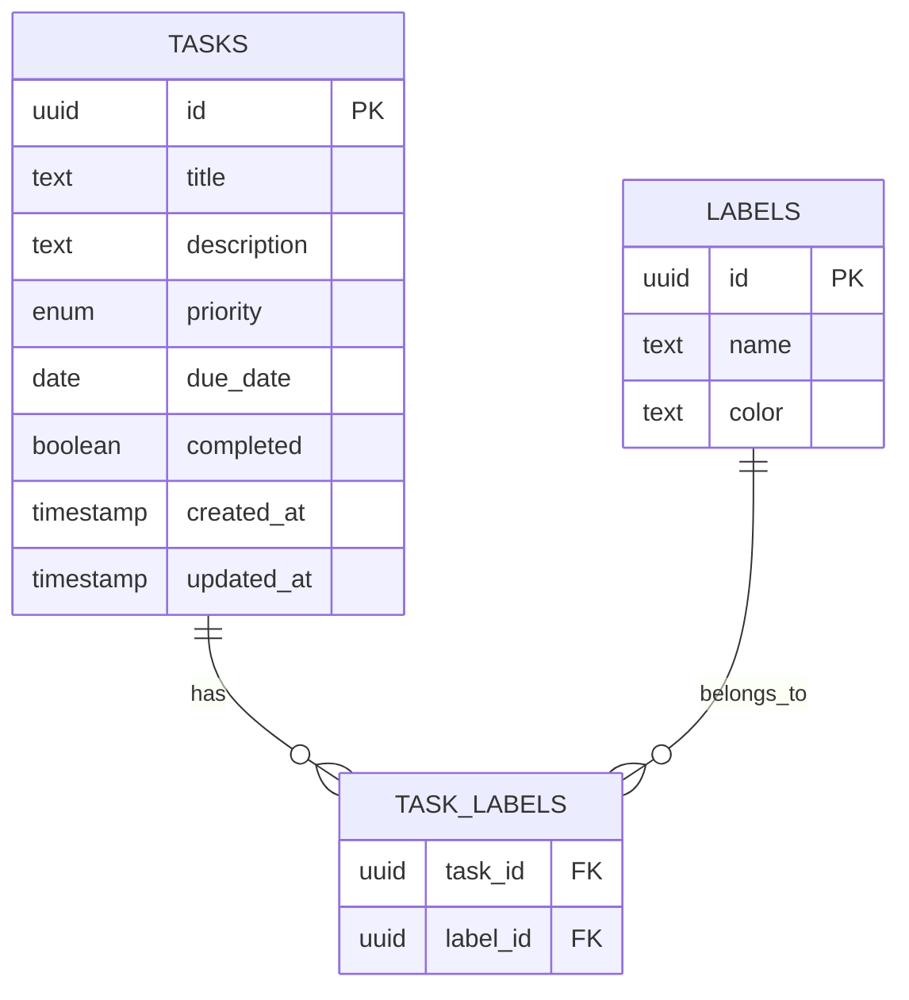

# ARCHITECTURE.md — Personal Task Tracker

## Системийн архитектур

### Layer диаграм



### Module диаграм

```mermaid
graph LR
    subgraph Pages
        Home[/ Home]
        TaskPage[/tasks]
    end

    subgraph Components
        TaskList[TaskList]
        TaskCard[TaskCard]
        TaskForm[TaskForm]
        FilterBar[FilterBar]
        SearchBox[SearchBox]
    end

    subgraph Hooks
        useTasks[useTasks]
        useFilter[useFilter]
        useSearch[useSearch]
    end

    subgraph API
        GET[GET /api/tasks]
        POST[POST /api/tasks]
        PUT[PUT /api/tasks/:id]
        DELETE[DELETE /api/tasks/:id]
    end

    Home --> TaskList
    TaskList --> TaskCard
    TaskList --> TaskForm
    TaskList --> FilterBar
    TaskList --> SearchBox
    TaskList --> useTasks
    FilterBar --> useFilter
    SearchBox --> useSearch
    useTasks --> GET
    useTasks --> POST
    useTasks --> PUT
    useTasks --> DELETE
```

### Data Flow диаграм



### Database Schema



## Модулийн тайлбар

| Модуль | Байршил | Үүрэг |
|--------|---------|-------|
| TaskList | components/TaskList | Бүх task-ийг харуулах |
| TaskCard | components/TaskCard | Нэг task-ийн card |
| TaskForm | components/TaskForm | Task үүсгэх/засах form |
| FilterBar | components/FilterBar | Priority, label шүүлтүүр |
| SearchBox | components/SearchBox | Гарчгаар хайх |
| useTasks | hooks/useTasks | CRUD API дуудалт |
| useFilter | hooks/useFilter | Шүүлтүүрийн логик |
| API routes | app/api/tasks | Backend endpoint |
